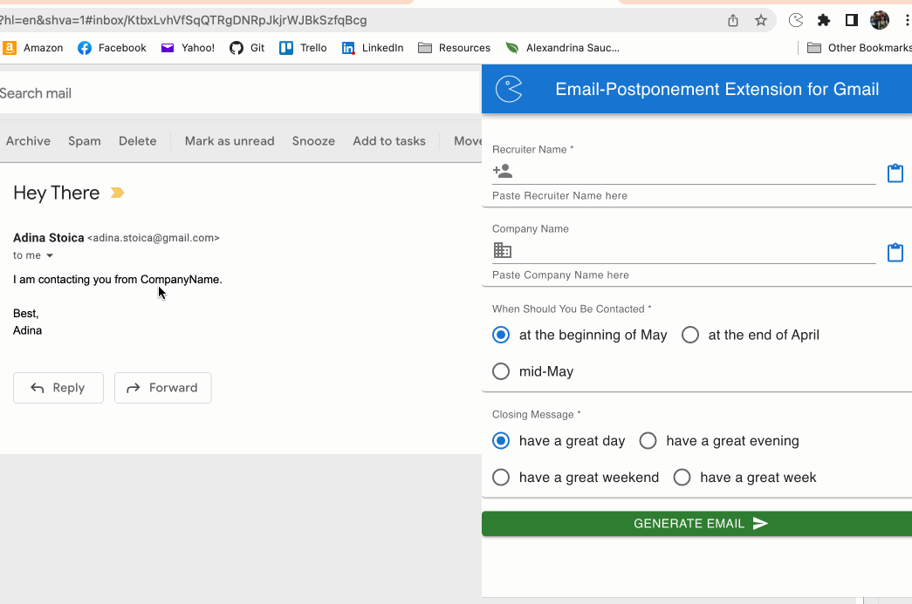
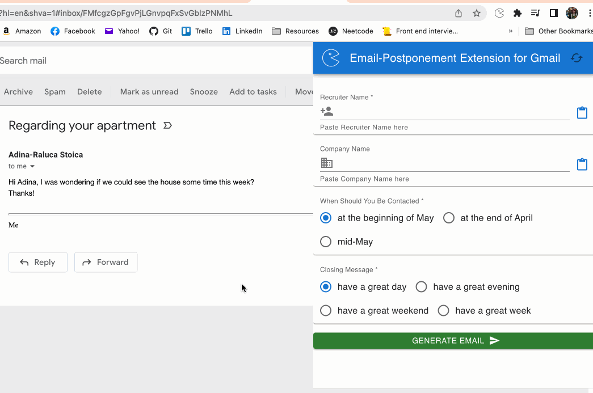

# emailPostponer
Chrome extension that auto-composes a reply email to ask for a follow-up at a later date

## Use The Extension
1. Clone the repo and cd into the directory
2. Install and build the extension (this might take a while):
    - `npm install`
    - `npm run build`
        - this should create a `"build"` folder in the extension folder - this is the extension code that needs to be loaded into Chrome
3. Load extension into Chrome by going to `chrome://extensions/`, turning developer mode on, and clicking `Load unpacked`. Select the `build` folder. The extension will now be available in the extension toolbar.

## Configuration
You can now create your own options for the autocomplete, and edit them even after building the extension. Just go to the `build` directory and edit any of the fields in the `config.json` file, either the text or by adding to the arrays. 

If the extension is already loaded, you can press the new Refresh <svg style="user-select: none;
    width: 1em;
    height: 1em;
    display: inline;
    fill: currentcolor;
    transition: fill 200ms cubic-bezier(0.4, 0, 0.2, 1) 0ms;
    font-size: 1rem;
    box-sizing: content-box;
    color: rgb(25, 118, 210)" viewBox="0 0 24 24" data-testid="CachedIcon"><path d="m19 8-4 4h3c0 3.31-2.69 6-6 6-1.01 0-1.97-.25-2.8-.7l-1.46 1.46C8.97 19.54 10.43 20 12 20c4.42 0 8-3.58 8-8h3l-4-4zM6 12c0-3.31 2.69-6 6-6 1.01 0 1.97.25 2.8.7l1.46-1.46C15.03 4.46 13.57 4 12 4c-4.42 0-8 3.58-8 8H1l4 4 4-4H6z"></path></svg> button on the top-right corner to reload the data.

Note that, if an array has 5 or more options, the checkboxes will change into a drop-down.

## Example

| To use the extension  | To change the config |
| ------------- | ------------- |
|   |   |

## Future Work
Next step is to integrate with Google Calendar to automatically add a reminder to follow up with the person on the specified date! Stay tuned!
